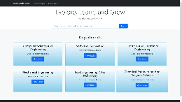
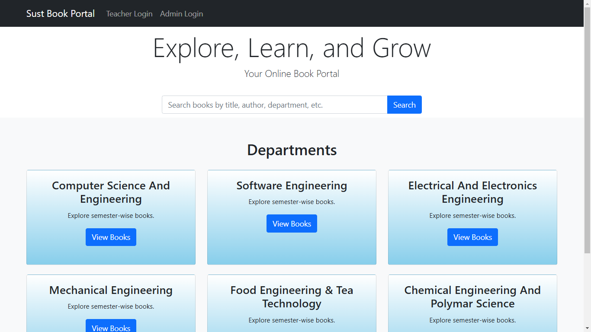
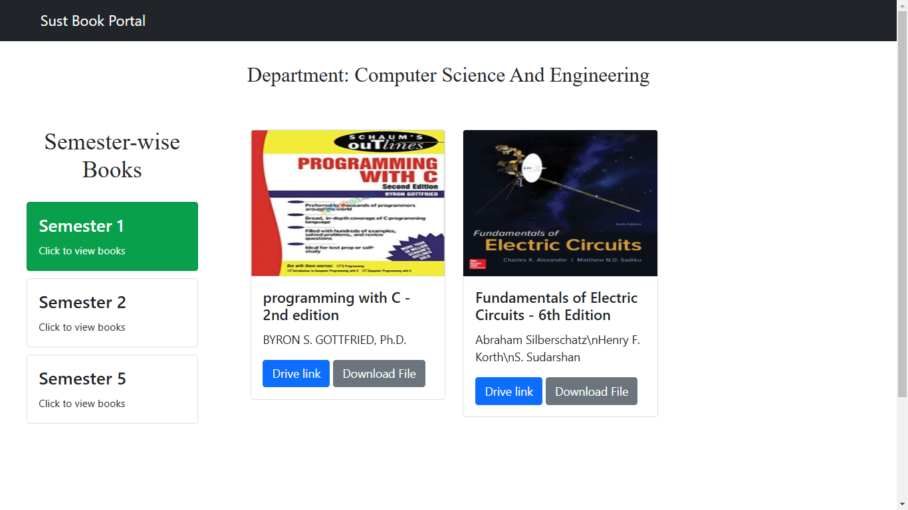
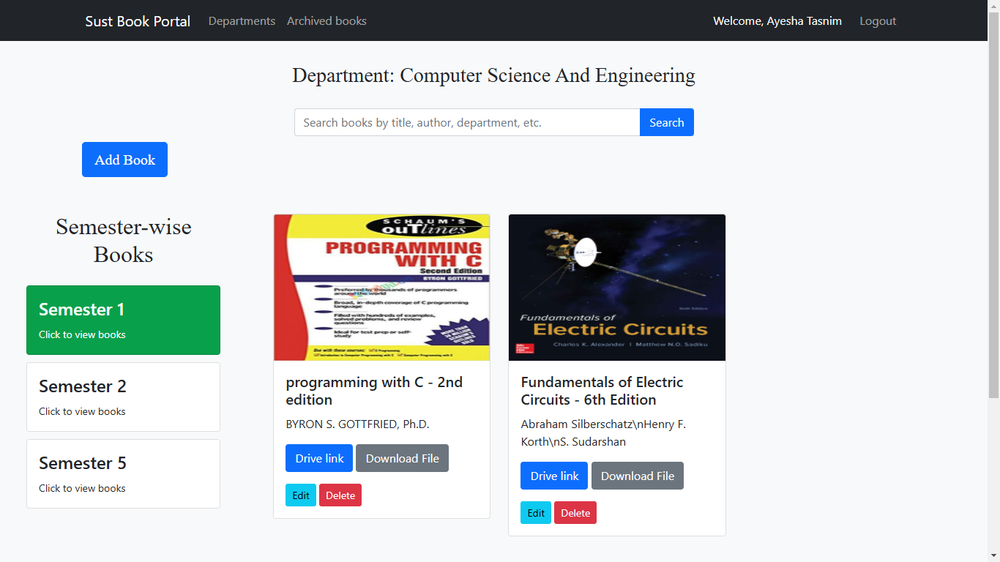
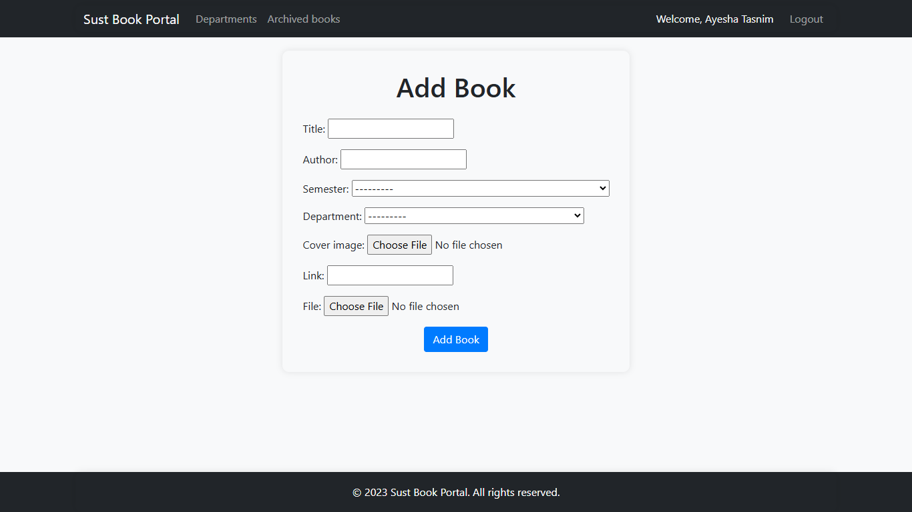
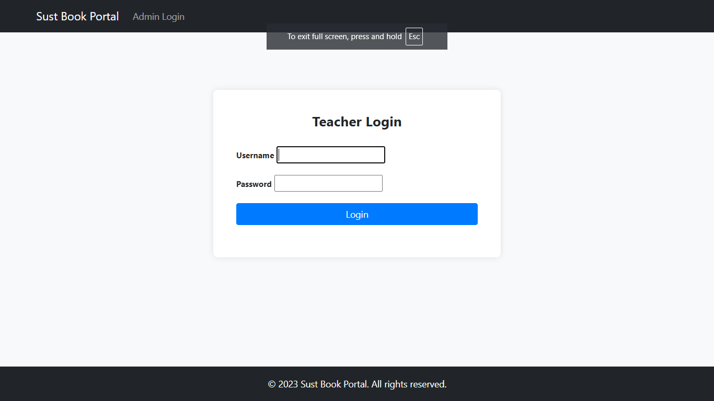
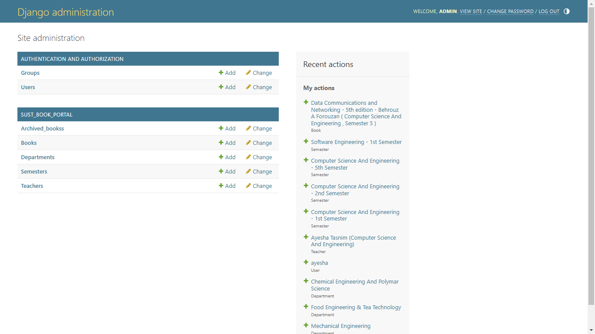

# University Book Management System (SUST Book Portal)

**University Book Management System** (SUST Book Portal) is a Django-based web application designed to manage and archive books for university departments. The system allows teachers to log in and manage semester-wise book records, including adding and modifying books for each department. It uses MySQL as the database.


## Table of Contents

1. [Demo Video](#demo-video)  
2. [Features](#features)  
3. [Screenshots](#screenshots)  
4. [Technologies Used](#technologies-used)
5. [Installation](#installation)  


##  Demo Video
[](./images/university_book_management_system_main.mp4)  
*Click on the image to view it in a larger size.*

## Features

- **Semester-wise book listing**: Displays books for each semester of a department.
- **Teacher login**: Teachers can log in and add or modify books.
- **Database**: MySQL is used as the backend database to store and manage book data.
- **Image support**: Teachers can upload book cover images.

---

## **Screenshots**


| Home Screen | Department books | Teacher Home page |
|-------------|-----------------|----------------------------|
|  |  |  |
| Teacher Add books | Teacher Login | Admin Home page |
|  |  |  |

---


## Technologies Used

- **Frontend**: HTML, CSS, JavaScript
- **Backend**: Python, Django
- **Database**: MySQL
- **Authentication**: Django's built-in authentication system
- **Image Handling**: Pillow (for book cover images)

## Installation

### 1. Clone the Repository

```bash
git clone https://github.com/AshikurRahman3/university_book_management_system.git

```


## Getting Started

Follow these steps to set up and run the project on your local machine:

### Prerequisites

- Python 3.11
- MySQL
- Visual Studio Code (or any code editor of your choice)

### Setup

1. Create a MySQL database named `university_book_management_system`.

2. Ensure that MySQL is running on your system.

3. Open the project's root folder in Visual Studio Code.

4. Open a new terminal in VS Code.

5. If the terminal says that scripts are disabled, set the execution policy to "RemoteSigned" in Windows PowerShell as an administrator.
6. if (venv) dosent see in terminal, make sure to install python 3.11 .  then activate venv by

 ```bash
 venv\Scripts\activate
 ```

### Database Setup

In the terminal, run the following commands to set up the database:

```bash
python manage.py makemigrations
python manage.py migrate
```
### Running the project

```bash
python manage.py runserver
```
The website will be accessible at http://localhost:8000.


### import sample database
in mysql workbench, click on **server**, then click on **data import**. select **import from self-contained file**. then selection location as this projects **mysql backup** folders **.sql** file. then you will get sample admin, sample teacher, sample books etc.

**sample admin:**

username: admin <br>
password: password


**sample teacher:**

username: ayesha <br>
password: ayesha_tasnim123

### Admin Access
To access the admin panel, create a superuser with the following command:
```bash
python manage.py createsuperuser
```
For simplicity, use the following credentials:

1. Username: admin
2. Password: password

You can now access the admin page and manage the system.

### Creating Teachers
To create a teacher, follow these steps:

1. Create a user.

2. Select the created user as a teacher.

3. Assign a department to the teacher.

### Creating semesters, departments, books 

similar like creating teacher from admin page.


## **Developer**

Developed by [Ashikur Rahman](https://github.com/AshikurRahman3).  
Feel free to explore my other projects on GitHub!
